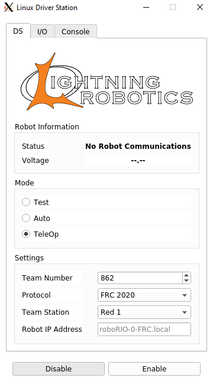

# Web-Based Driver Station

| CI | Build |
|-|-|
| `LibDS` |  |
| `DSClient` |  |
| `WebDS` |  |

**IN PROGRESS**: Web-based driver station client for FRC

## LibDS

Library for interfacing with FRC robots.

Extension of project [here](https://github.com/FRC-Utilities/LibDS).

### Building LibDS

#### Linux

```bash
make clean
qmake -config release
make
```

#### Windows

```bash
nmake -clean
qmake -config release
nmake
```

## DSClient

FRC Driver Station client able to interface with robots and remote input via WebDS (assumes robot is linked to internet-enabled network).



### Building DSClient

Build with [CQtDeployer](https://github.com/QuasarApp/CQtDeployer).

Useful documentation [here](https://github.com/QuasarApp/CQtDeployer/wiki/quickguide).

In addition to installing qt5, the project also requires the [qtwebsocket module](https://github.com/qt/qtwebsockets) as the application uses the WebSocket Protocol to communicate with WebDS.

#### Linux

Install CQtDeployer:

```bash
wget https://github.com/QuasarApp/CQtDeployer/releases/downloads/1.4.5/LinuxInstaller.run
chmod +x LinuxInstaller.run
./LinuxInstaller.run
```

Build Qt Application Binaries (from application directory):

```bash
make clean
qmake -config release
make
```

Make Run Script (from application directory):

```bash
cqtdeployer -bin LightningDS
```

Make installer (from application directory):

```bash
cqtdeployer -bin LightningDS qif
```

##### Build Script

`/DSClient/LightningDS/build.sh`

Build script can be run with `-i` flag to generate installer.

#### Windows

Install CQtDeployer [here](https://github.com/QuasarApp/CQtDeployer/releases/downloads/1.4.5/WindowsInstaller.run)

Build Qt Application Binaries (from application directory):

```bash
nmake clean
qmake -config release
nmake
```

Make Run Script (from application directory):

```bash
cqtdeployer -bin SimpleDS.exe -qmake C:/Qt/<version>/min_gw/bin/qmake.exe
```

##### Build Script

`/DSClient/LightningDS/build.bat`*

*Build script will not run `cqtdeployer`

## WebDS

Spring Boot web application for relaying driver input and robot video feedback between a robot and a remote driver.

### Building WebDS

Build project with

```bash
./gradlew build
```

Deploy project locally with

```bash
./gradlew bootRun
```

Compile deployable web resource with

```bash
./gradlew bootWar
```
